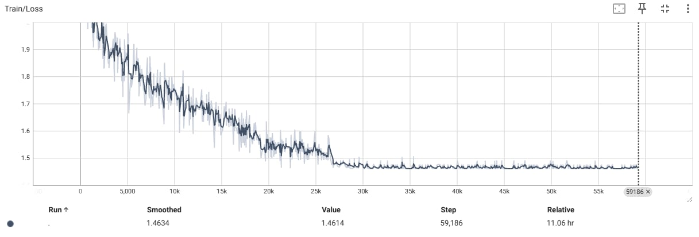

 <h1 align="center">ResNet-34</h1>

## Introduction
Here is my python source code for ResNet-34 model - the model that won the the first prize ILSVRC and COCO 2015

## Dataset
* The dataset used for training my model could be found at [Animals-10] https://www.kaggle.com/datasets/alessiocorrado99/animals10 
* Or could be download by **python download_dataset.py**

## Categories
The table below shows 10 categories my model used:

|           |           | 
|-----------|:-----------:|
|    dog    |    cat    |  
|   horse   |    cow    |  
|  elephant |   sheep   |  
| butterfly |   spider  | 
|  chicken  |  squirrel | 

## Trained models
You could find my trained model at **trained_models/best_resnet34.pt**

## Training
* After the raw dataset has been downloaded, you need to split dataset into training/validate sets with ration 8:2 by run **dataset.py**.
* Then you could simply run **python train_nn.py**

## Experiments
The loss on training set and accuracy on test set curves for the experiment are shown below:

 
 

The confusion matrix of validate set are shown below:
 

# Testing
After completing model training, we can put the model into practical use by run 
**python test_nn.py -p [file path]**

 

## Requirements
* **python 3.11**
* **cv2 4.11**
* **pytorch 2.0** 
* **numpy**